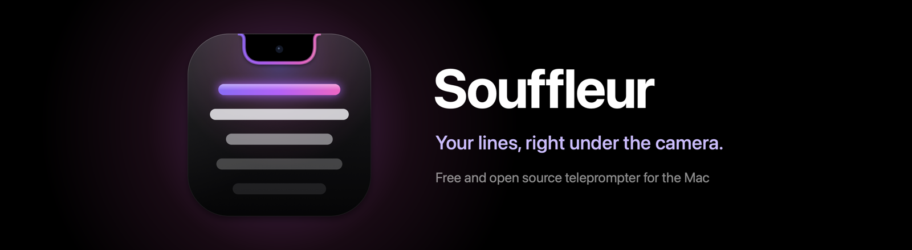
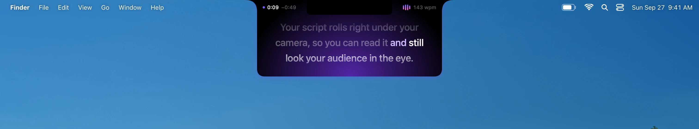
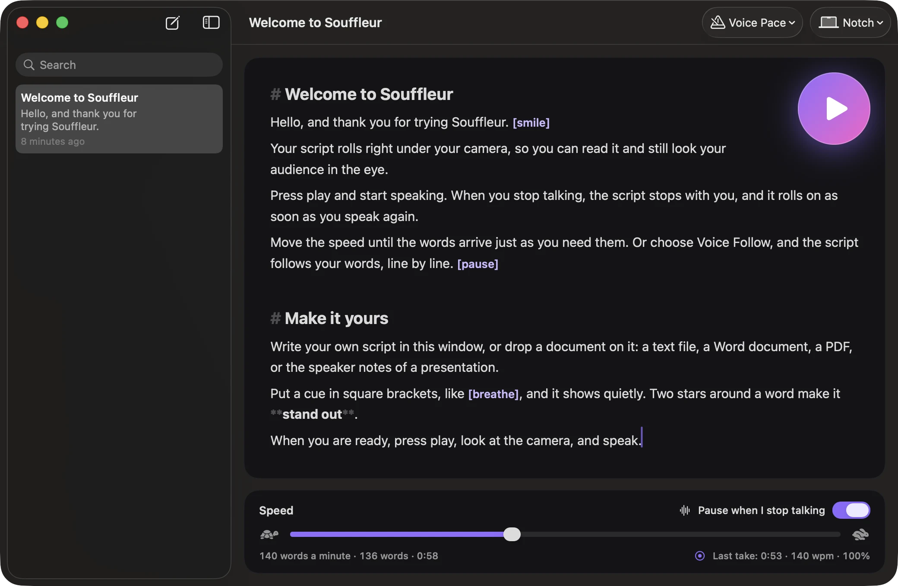

<p align="center">
  
</p>

<p align="center">
  <a href="LICENSE"></a>
  
  
  
  <a href="https://github.com/ruben4reall/souffleur/actions/workflows/ci.yml"></a>
</p>

# Souffleur

**Your lines, right under the camera.**

[Website](https://getsouffleur.vercel.app) · [Download for Mac](https://github.com/ruben4reall/souffleur/releases/latest/download/Souffleur.dmg) · [Changelog](CHANGELOG.md)

In the theatre, the souffleur hides in a small box at the edge of the stage and whispers the next line. On a MacBook,
that box is already there: the notch, a few millimetres from the lens.

Souffleur is a free, open source teleprompter for the Mac, written in Swift. It hangs your script from the notch,
rolls it while you speak and stops the moment you do, and stays out of your screen recordings, so you keep eye
contact on every call, video and talk. It does what the paid notch prompters do, then adds word by word voice follow,
a phone remote, clicker support, a full screen mirror for rigs and a coach after every take.

<p align="center">
  
</p>

## What it does

- **Stops when you stop.** Press play and speak: the script rolls at your speed and waits as soon as you go quiet,
  then rolls on when you speak again. Speech is detected on your Mac, in any language.
- **Invisible in screen recordings.** The prompter is on your screen and out of screenshots, recordings and screen
  sharing: your audience sees you, not your script.
- **Voice follow.** Choose it, and the script follows your words one by one: the words you have said dim, the next
  one lights up, and the line you are on stays under the camera. Skip a paragraph and it finds you again. Numbers,
  contractions and accents are understood, and the recogniser is given your script's own words, so names and jargon
  are heard right.
- **Four ways to scroll.** Voice Pace (rolls while you speak, the default), Voice Follow, Auto Scroll (a steady pace
  in words per minute) and Manual.
- **Three places.** Right below the notch, leaving the menu bar free, with the time and your voice in a band at its top
  and a violet light inside; floating anywhere, in glass; or full screen on any display, mirrored for a teleprompter
  rig.
- **Hands free.** Global shortcuts, presentation clickers and foot pedals (Page Up and Page Down), a phone remote over
  your local network, `souffleur://` links and Shortcuts actions.
- **Scripts.** A library of plain Markdown files, light markup (`# headings`, `[cues]`, `**emphasis**`), and import from
  text, Markdown, RTF, Word, PDF and PowerPoint speaker notes.
- **Coach.** Your pace live beside the camera, and after each take your time, pace and how much of the script you
  covered, with one click to roll at your own pace next time.
- **Fit in.** One click sets the speed so the script lasts exactly 30 seconds, a minute or two: made for shorts and
  pitches.
- **Yours to shape.** Font, size, spacing, the colour of the light, width, lines, countdown, mirror, the language to
  listen in.

<p align="center">
  
</p>

## Install

### Download

1. [Download Souffleur](https://github.com/ruben4reall/souffleur/releases/latest/download/Souffleur.dmg), open the disk
   image and drag Souffleur to Applications.
2. Open it. A short welcome shows what it does. Souffleur asks for the microphone when you first press play, to hear
   when you speak; choose Auto Scroll and it never does.

Releases are signed with a Developer ID and notarized by Apple.

### Homebrew

```sh
brew install --cask ruben4reall/tap/souffleur
```

### Updates

Souffleur updates itself with [Sparkle](https://sparkle-project.org). You can turn automatic checks off in Settings,
General. Every update is signed with Souffleur's own key.

### Uninstall

Quit Souffleur and move it to the Trash. Your scripts are in `~/Library/Application Support/Souffleur/Scripts`, its
settings in `~/Library/Preferences/ch.rubencatalao.souffleur.plist`. With Homebrew:
`brew uninstall --cask --zap souffleur`.

## Use it

Write or drop a script, press the play button (⌘↩), look at the camera and speak.

| Shortcut | What it does |
|---|---|
| ⌃⌥⌘P | Prompt the selected script, then play or pause |
| ⌃⌥⌘↑ ⌃⌥⌘↓ | Faster, slower |
| ⌃⌥⌘← ⌃⌥⌘→ | Back or forward a line |
| ⌃⌥⌘R | Restart |
| ⌃⌥⌘H | Show or hide the prompter |
| Page Up, Page Down | A presentation clicker or a foot pedal, while the prompter is open |

On the prompter itself: click to pause, scroll with two fingers to move the text, and rest the pointer on it for the
controls. In full screen, Space, the arrows and Escape work too.

**Phone remote.** In Settings, Controls, turn on the phone remote and scan the code. A page opens on your phone with
play, pause, pace and the line you are on. Your phone must be on the same network; the server only answers requests
that carry the pairing code, and only from your local network.

**Links and Shortcuts.** `souffleur://prompt?text=Hello` prompts any text; `play`, `pause`, `toggle`, `faster`,
`slower`, `restart`, `stop` and `clipboard` do what they say. The Shortcuts app lists Souffleur's actions.

**Markup.** All optional: a line starting with `#` is a heading, shown and never read; `[pause]` is a cue, shown quietly
and never waited for; `**words**` are emphasised.

## Other notch apps

Souffleur hangs just below the notch and never covers the menu bar, so whatever Islet, NotchNook or boring.notch show
beside the camera stays where it is. While the prompter is open it stays in front of their expanded views; they come
back as soon as it closes. An app that wants to step aside can listen for two distributed notifications,
`ch.rubencatalao.souffleur.prompterDidOpen` (its user info gives the `placement`: `notch`, `floating` or `fullScreen`)
and `ch.rubencatalao.souffleur.prompterDidClose`.

## Privacy

- Your voice is recognised on your Mac. Souffleur never sends it to a server: when a language cannot be recognised
  offline, it rolls at your pace instead.
- No account, no telemetry, no analytics, no crash reports.
- Network: the update check, and the local phone remote when you turn it on. Nothing else.

[SECURITY.md](SECURITY.md) lists everything Souffleur touches on your Mac.

## Invisible in screen recordings

The prompter asks macOS to leave it out of screenshots, screen recordings and screen sharing, and macOS does. On
macOS 26.5 we checked the Mac's own screenshots and screen recordings, and a capture made with ScreenCaptureKit, the
framework screen recorders and meeting apps are built on: the prompter is on the screen and nowhere in the picture.
Your audience sees you, not your script. What no app can hide it from: a display that mirrors your screen, or a
camera pointed at it. To show the prompter in a tutorial, turn this off in Settings, Prompter.

## Compatible Macs

- macOS 14 Sonoma or later, Apple silicon and Intel.
- **In the notch** on MacBook Pro 14 and 16 inch (2021 and later) and MacBook Air 13 and 15 inch (M2 and later).
- **Everywhere else**, the prompter hangs from the middle of the menu bar, floats wherever you put it, or fills a
  display.
- Voice follow uses SpeechAnalyzer on macOS 26 when its model for your language is on the Mac, and on-device
  SFSpeechRecognizer otherwise.

## Build from source

You need Xcode 26 and [XcodeGen](https://github.com/yonaskolb/XcodeGen).

```sh
brew install xcodegen
git clone https://github.com/ruben4reall/souffleur.git
cd souffleur
swift test --package-path Packages/SouffleurKit   # the script parser, the voice tracker, pace, geometry, remote
scripts/build.sh                                  # prints the path of the Debug app
open .build/xcode/Build/Products/Debug/Souffleur.app
```

- Demo switches, for screenshots and for working without a microphone: `-SouffleurDemo notch` (or `floating`,
  `fullScreen`) opens the prompter on the welcome script, `-SouffleurDemoVoice YES` reads it through the voice tracker
  at 150 words a minute, `-SouffleurDemoStop 16` stops at a word, `-SouffleurDemoHover YES` shows the controls.
  `scripts/capture-site.sh` uses them to photograph the real app for the website and this README.
- `node site/tools/audit.mjs` checks the website at four sizes under its production headers.
- `scripts/release.sh` makes a disk image. Without `SOUFFLEUR_TEAM_ID` it is ad hoc, for your own use; with a team it
  is signed, notarized and stapled, and `scripts/finish-release.sh` writes the signed update feed.

| Folder | What lives there |
|---|---|
| `Packages/SouffleurKit/Sources/SouffleurCore` | The script parser, the voice tracker, pace, the coach, the prompter's geometry, the remote's protocol. No AppKit, fully tested |
| `Packages/SouffleurKit/Sources/SouffleurShell` | The prompter (panel, Core Animation outline and glow, TextKit text), speech, the library, controls, settings |
| `App/` | Entry point, updates, Shortcuts actions, demo switches |
| `site/` | The website and the update feed |
| `brand/` | The icon and the pictures that stand for Souffleur |

## Credits

- Updates by [Sparkle](https://sparkle-project.org) (MIT).
- The prompter's outline and motion come from [Islet](https://github.com/ruben4reall/islet), by the same author.

Licenses and notices: [THIRD-PARTY-NOTICES.md](THIRD-PARTY-NOTICES.md).

## Contributing

Bugs go to [issues](https://github.com/ruben4reall/souffleur/issues), questions and ideas to
[discussions](https://github.com/ruben4reall/souffleur/discussions); pull requests are welcome.
[CONTRIBUTING.md](CONTRIBUTING.md) gives the workflow and the promises every change keeps, and
[SECURITY.md](SECURITY.md) how to report a vulnerability privately.

## License

MIT. See [LICENSE](LICENSE).

Souffleur is not affiliated with Apple. MacBook and macOS are trademarks of Apple Inc.
